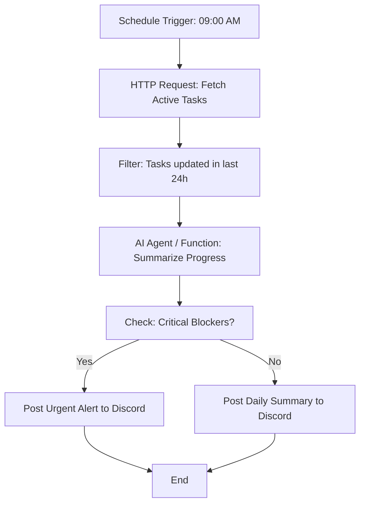

# n8n Workflow Design: Project 990 Daily Status & Task Integration

## 1. Overview
This workflow automates the aggregation of task updates from the OpenClaw Task Dashboard (Project 990) and generates a daily summary report sent to a messaging platform (Discord/Slack).

## 2. Workflow Logic (Flowchart)

## 3. Implementation Steps
1.  **Deployment**: Ensure n8n is running on Zeabur.
2.  **Credentials**: Setup API credentials for the OpenClaw Backend and Discord Webhook.
3.  **Import**: Import the provided JSON template into n8n.
4.  **Configuration**: 
    - Update `Task_API_URL` to point to the Zeabur-deployed backend.
    - Set `DISCORD_WEBHOOK_URL`.
5.  **Testing**: Execute a manual run to verify data parsing.

## 4. Expected Value
- Reduces manual reporting time by 15 mins/day per developer.
- Ensures stakeholders are alerted to "Blocker" status immediately.
