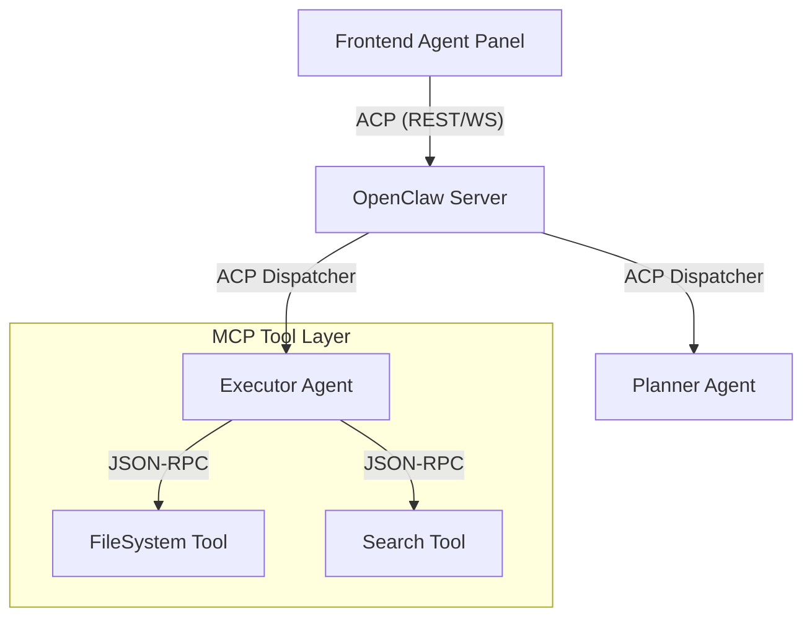

# 技術提案：OpenClaw 整合 MCP 與 ACP 協議之研究與規劃

## 1. 背景與目標
本提案旨在分析 **Model Context Protocol (MCP)** 與 **Agent Communication Protocol (ACP)** 的核心價值，並探討如何將其引入 OpenClaw 架構中，以提升工具調用的標準化程度、跨 Agent 協作的互操作性，以及系統的異步處理能力。

## 2. 核心協議摘要

### Model Context Protocol (MCP)
- **核心概念**：由 Anthropic 發起，旨在標準化 AI 模型如何與外部數據源和工具（Tools, Resources, Prompts）進行互動。
- **通訊方式**：基於 JSON-RPC 2.0，支援 stdio、HTTP/SSE 調用。
- **優勢**：一次編寫，多處使用（Claude Desktop, OpenClaw, IDEs）。

### Agent Communication Protocol (ACP)
- **核心概念**：聚焦於 Agent 與 Agent、Agent 與任務看板之間的通訊規範。
- **特性**：REST-native、異步優先、狀態機導向（Task Lifecycle: created, running, completed, failed）。
- **優勢**：解耦任務調度與執行邏輯，支持長耗時任務的進度追蹤。

## 3. OpenClaw 現有組件分析

| 組件 | 現狀 | 整合潛力 |
| :--- | :--- | :--- |
| **executor-agents.ts** | 使用內建的 `run_script`, `read_file` 等硬編碼工具。 | 轉化為 **MCP Host**，透過 MCP Server 動態加載工具。 |
| **openclaw-tasks.ts** | 現有的 `create_task` 偏向同步或本地事件。 | 轉向符合 **ACP** 規範的 REST API 指令與 Webhook 狀態更新。 |
| **types.ts** | 定義了基礎的 Task 與 Agent 接口。 | 擴展標準化的 `TaskRequest` 與 `ToolResult` JSON-RPC 結構。 |
| **Frontend UI** | 直接與 Server API 互動。 | 引入 ACP 兼容的異步通知機制，實時展示 Agent 間的溝通內容。 |

## 4. 整合初步概念設計

### 整合架構圖 (Conceptual Architecture)

### 實作路徑
1.  **工具抽象化 (MCP Integration)**：
    - 將 `executor-agents.ts` 中的具體執行邏輯重構。
    - 實作一個 `MCPHost` 類別，負責啟動 MCP Server 並將其 Tool 定義映射給 LLM。
2.  **通訊標準化 (ACP Integration)**：
    - 定義符合 ACP 的 `/tasks` 端點。
    - 引入 `TaskEvent` 機制，Agent 執行過程中產生的 Step 或 Status 變更皆透過標準格式傳送。

## 5. 潛在挑戰與優勢分析

### 挑戰
- **性能開銷**：JSON-RPC 與多層抽象可能引入微小的延遲。
- **安全性**：動態加載 MCP 工具需要嚴格的 Sandbox 隔離。
- **過渡成本**：現有腳本工具需轉換為符合 MCP 規範的 Server。

### 優勢
- **生態兼容性**：可以直接使用現成的 MCP 生態工具（如 Google Maps, SQL, GitHub tools）。
- **可擴展性**：新增 Agent 類型只需遵循 ACP 接口，無需修改 Server 核心邏輯。
- **可觀測性**：標準化的通訊格式讓任務執行歷程更易於追蹤與 Debug。

## 6. 建議的下一步行動

1.  **POC 第一階段**：在 OpenClaw 中實作一個簡單的 MCP Host，嘗試透過 MCP 調用外部的 `fetch` 工具，而非使用現有的 `run_script`。
2.  **API 升級**：將 `create_task` 的 Payload 改為 ACP 推薦的 `input` / `additional_input` 格式。
3.  **UI 適配**：前端任務板增加一個 "Protocol Trace" 視窗，顯示原始的 MCP/ACP 訊息交換。

## 7. 結論

優先整合 **MCP**。
**理由**：OpenClaw 當前的瓶頸在於工具調用的擴展性。引入 MCP 可以立即解鎖大量的開源工具資源，且 MCP 已經有穩定的 JSON-RPC 實作可循。

### 具體驗證指標 (POC Metrics)
1.  **Tool Latency**: MCP 調用的延遲應低於傳統函數調用的 10ms (額外開銷)。
2.  **Compatibility**: 成功接入至少 2 個現有的社群 MCP Server。
3.  **Task Success Rate**: 在異步 ACP 模式下，長任務（執行 > 1 分鐘）的狀態追蹤正確率需達 100%。

---
*Generated by OpenClaw Task Executor - 2026-03-01*
