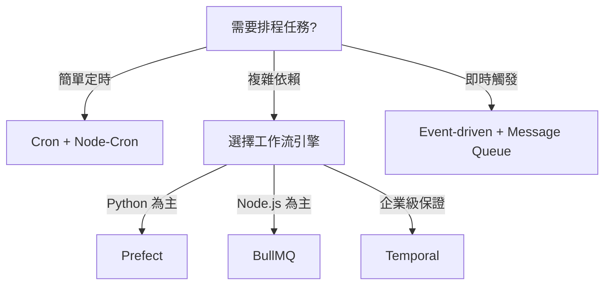

# 架構研究報告：工作排程化、中控任務、自動開發流程

**研究員**: 架構研究員 Beta  
**日期**: 2026-02-12  
**研究主題**: Multi-Agent 任務排程、中控系統、自動化開發流程

---

## 📋 執行摘要

### 核心發現
1. **2026 年是 Multi-Agent 系統從實驗室走向生產的轉捩點**，80% 企業計畫在 2 年內導入多 Agent 協作，但目前僅 10% 成功部署
2. **三大協議標準化**正在改變遊戲規則：MCP（Anthropic）、A2A（Google）、ACP（IBM）
3. **混合編排模式**（Hub-and-Spoke + Mesh）成為主流，純中心化或純分散式都有致命缺陷
4. **AI 增加 25-35% 代碼產出，但人工審查能力沒變**，形成 40% 的品質缺口

### 關鍵數據
- Multi-agent 系統比單一 Agent：**問題解決速度快 45%**、**準確度高 60%**
- IBM 研究：多 Agent 協作**減少 45% 交接次數**、**決策速度提升 3 倍**
- 預估 2028 年 AI Agent 將產生 **4,500 億美元經濟價值**

---

## 🎯 主題一：工作排程化

### 📊 現狀分析

#### 問題核心
傳統 Cron job 模式無法應對 Multi-Agent 的複雜需求：
- **時間衝突**：多個 Agent 同時搶奪資源（API quota、database connections）
- **重複執行**：分散式環境下缺乏協調機制，同一任務被多次觸發
- **依賴管理**：Agent A 的輸出是 Agent B 的輸入，時序錯亂導致失敗
- **彈性不足**：固定時間執行無法應對動態工作負載

#### 三種範式比較

| 範式 | 適用場景 | 優點 | 缺點 |
|------|---------|------|------|
| **Cron-based** | 固定時間的簡單任務（報表生成、備份） | 可預測、易理解、低延遲 | 無法處理依賴、容易衝突 |
| **Event-driven** | 即時反應型工作（用戶觸發、Webhook） | 低延遲、資源高效 | 難以調試、順序難保證 |
| **Queue-based** | 高吞吐量、有依賴關係的批次任務 | 可靠、可擴展、支援重試 | 增加系統複雜度、有延遲 |

### 🏢 業界方案

#### 1. **Prefect（Python 生態首選）**
```python
from prefect import flow, task
from prefect.deployments import Deployment

@task(retries=3, retry_delay_seconds=60)
def research_agent(topic: str):
    # Agent 研究邏輯
    return results

@task
def writer_agent(research_data):
    # Agent 寫作邏輯
    return article

@flow(name="multi-agent-research")
def orchestrate_research(topic: str):
    data = research_agent(topic)
    article = writer_agent(data)
    return article

# 部署：支援 Cron、Event、Manual 觸發
deployment = Deployment.build_from_flow(
    flow=orchestrate_research,
    name="daily-research",
    schedule={"cron": "0 9 * * *"}
)
```

**特色**：
- **Hybrid Orchestration**：同時支援 Cron、Event、Queue
- **Observable Workflows**：視覺化 Dashboard 追蹤每個 Agent 狀態
- **自動重試 + 錯誤處理**：避免單點失敗導致整個流程崩潰

#### 2. **BullMQ（Node.js 輕量選擇）**
```javascript
import { Queue, Worker } from 'bullmq';

const researchQueue = new Queue('research-tasks', {
  connection: { host: 'localhost', port: 6379 }
});

// 添加任務（可設定優先級、延遲、重試）
await researchQueue.add('research', 
  { topic: 'AI Orchestration' },
  { 
    priority: 1,
    attempts: 3,
    backoff: { type: 'exponential', delay: 5000 }
  }
);

// Worker 處理任務
const worker = new Worker('research-tasks', async (job) => {
  const { topic } = job.data;
  // 呼叫 Agent 執行研究
  const result = await executeAgent('researcher', topic);
  return result;
});
```

**特色**：
- **基於 Redis**：輕量、快速、支援分散式
- **Rate Limiting**：避免 API quota 超限
- **Child Jobs**：支援樹狀任務依賴（Agent A → Agent B → Agent C）

#### 3. **Temporal（企業級工作流引擎）**
- **強一致性保證**：即使系統崩潰，工作流也能從中斷處恢復
- **無限重試**：內建指數退避策略
- **版本管理**：同一工作流的不同版本可以共存運行

**缺點**：學習曲線陡峭、需要額外的 Temporal Server

### ✅ 建議做法

#### 根據場景選擇架構



#### 混合模式（推薦）

```
┌─────────────────────────────────────┐
│  Cron Scheduler (簡單定時任務)        │
│  - 每日報表生成                        │
│  - 週期性清理                          │
└──────────────┬──────────────────────┘
               │
┌──────────────▼──────────────────────┐
│  Event Bus (即時響應)                 │
│  - 用戶觸發的任務                      │
│  - Webhook 接收                       │
└──────────────┬──────────────────────┘
               │
┌──────────────▼──────────────────────┐
│  Task Queue (複雜工作流)              │
│  - Multi-agent 協作                   │
│  - 有依賴關係的任務                    │
│  - 需要重試機制                        │
└─────────────────────────────────────┘
```

### 🛠️ 實作步驟

#### Phase 1: 基礎設施（Week 1）
```bash
# 1. 安裝 Redis（BullMQ 依賴）
brew install redis
redis-server

# 2. 初始化專案
npm install bullmq ioredis

# 3. 建立基本 Queue
mkdir task-orchestration
cd task-orchestration
npm init -y
```

#### Phase 2: 實作任務隔離（Week 2）
```javascript
// task-manager.js
import { Queue } from 'bullmq';

class AgentTaskManager {
  constructor() {
    this.queues = new Map();
    this.locks = new Map(); // 防止重複執行
  }

  async addTask(agentId, taskData, options = {}) {
    // 每個 Agent 獨立的 Queue
    if (!this.queues.has(agentId)) {
      this.queues.set(agentId, new Queue(`agent-${agentId}`));
    }

    // 防重複機制：使用 taskId 作為去重鍵
    const taskId = options.taskId || `${agentId}-${Date.now()}`;
    const lockKey = `lock:${taskId}`;

    if (this.locks.has(lockKey)) {
      console.log(`Task ${taskId} already running, skipped`);
      return null;
    }

    this.locks.set(lockKey, true);

    const queue = this.queues.get(agentId);
    const job = await queue.add('task', taskData, {
      jobId: taskId, // 確保同一 taskId 只執行一次
      removeOnComplete: true,
      removeOnFail: false,
      attempts: options.retries || 3,
      backoff: {
        type: 'exponential',
        delay: 5000
      }
    });

    return job;
  }

  async executeDependentTasks(workflow) {
    // 執行有依賴關係的任務鏈
    // workflow = [
    //   { agent: 'researcher', after: null },
    //   { agent: 'writer', after: 'researcher' },
    //   { agent: 'reviewer', after: 'writer' }
    // ]
    const results = new Map();

    for (const step of workflow) {
      if (step.after) {
        // 等待前置任務完成
        await results.get(step.after);
      }

      const job = await this.addTask(step.agent, step.data);
      results.set(step.agent, job.waitUntilFinished());
    }

    return results;
  }
}
```

#### Phase 3: 監控與告警（Week 3）
```javascript
// monitoring.js
import { QueueEvents } from 'bullmq';

const queueEvents = new QueueEvents('agent-researcher');

queueEvents.on('completed', ({ jobId }) => {
  console.log(`✅ Job ${jobId} completed`);
  // 發送到 Prometheus/Grafana
});

queueEvents.on('failed', ({ jobId, failedReason }) => {
  console.error(`❌ Job ${jobId} failed: ${failedReason}`);
  // 發送告警到 Telegram/Slack
});

queueEvents.on('stalled', ({ jobId }) => {
  console.warn(`⚠️ Job ${jobId} stalled (可能是 Worker 崩潰)`);
});
```

---

## 🎛️ 主題二：中控任務系統

### 📊 現狀分析

#### 核心挑戰
設計一個「指揮官 Agent」面臨以下問題：
1. **如何決定任務分配？** 基於能力？負載？歷史表現？
2. **如何避免單點失敗？** 中控 Agent 掛掉怎麼辦？
3. **如何維持上下文？** Agent A 的輸出如何完整傳遞給 Agent B？
4. **如何處理衝突？** 兩個 Agent 給出矛盾的結果時誰決定？

### 🏢 業界方案

#### 1. **Anthropic Multi-Agent Research System**

**架構模式：Hierarchical Orchestration（階層式編排）**

```
┌─────────────────────────────────────────┐
│  Orchestrator Agent (Claude 3.5 Sonnet) │
│  - 任務分解                               │
│  - Agent 選擇                             │
│  - 結果合成                               │
└──────────┬──────────────────────────────┘
           │
     ┌─────┴──────┬──────────┬──────────┐
     │            │          │          │
┌────▼───┐ ┌─────▼────┐ ┌──▼─────┐ ┌──▼─────┐
│Research│ │ Writer   │ │ Critic │ │ Fact   │
│Agent   │ │ Agent    │ │ Agent  │ │Checker │
└────────┘ └──────────┘ └────────┘ └────────┘
```

**關鍵機制：Model Context Protocol (MCP)**
```javascript
// MCP 標準化 Agent 間的工具調用
{
  "method": "tools/call",
  "params": {
    "name": "research_web",
    "arguments": {
      "query": "AI orchestration patterns 2026",
      "max_results": 10
    }
  }
}
```

**特色**：
- **中央協調**：單一 Orchestrator 負責決策
- **專業分工**：每個 Agent 只做一件事
- **可追溯性**：所有決策都可追蹤

**缺點**：
- **單點瓶頸**：Orchestrator 成為性能瓶頸
- **延遲增加**：每次決策都要經過中央節點

#### 2. **OpenAI Swarm（輕量級 Multi-Agent 框架）**

**架構模式：Agent-to-Agent Protocol（去中心化協作）**

```python
from swarm import Agent, Swarm

# 定義 Agent 間的交接規則
def transfer_to_writer():
    return writer_agent

researcher_agent = Agent(
    name="Researcher",
    instructions="搜尋並整理資料",
    functions=[search_web, scrape_page],
    handoff=transfer_to_writer  # 完成後交接給 writer
)

writer_agent = Agent(
    name="Writer",
    instructions="將研究結果寫成文章",
    functions=[generate_outline, write_content]
)

# 執行（無中央控制器）
client = Swarm()
response = client.run(
    agent=researcher_agent,
    messages=[{"role": "user", "content": "研究 AI orchestration"}]
)
```

**特色**：
- **輕量級**：代碼少於 1000 行
- **動態路由**：Agent 自己決定下一步交給誰
- **無中央瓶頸**：點對點通信

**缺點**：
- **難以調試**：分散式決策難追蹤
- **缺乏全局視野**：沒有中央協調者掌握全局

#### 3. **Google ADK（Agent Development Kit）**

**架構模式：Coordinator Pattern（協調者模式）**

```python
from google.adk import Coordinator, Agent

# Coordinator 接收請求，分發給專門的 Agent
coordinator = Coordinator(
    agents=[
        Agent("customer_service", skills=["billing", "account"]),
        Agent("tech_support", skills=["troubleshooting", "integration"]),
        Agent("sales", skills=["demo", "pricing"])
    ],
    routing_strategy="skill_based"  # 基於技能路由
)

# 自動路由到正確的 Agent
response = coordinator.handle_request(
    "I can't access my payslip"
)
# → 自動路由到 tech_support → 發現是 finance 系統問題
#   → 再路由到 customer_service (finance) → 解決
```

**特色**：
- **智能路由**：基於 Agent 技能自動分配
- **動態負載平衡**：避免單一 Agent 過載
- **上下文保留**：Agent 間傳遞完整上下文

### ✅ 建議做法

#### 混合架構：Hierarchical + Mesh（推薦）

```
                ┌──────────────────┐
                │ Orchestrator     │
                │ (高層決策)        │
                └────────┬─────────┘
                         │
         ┌───────────────┼───────────────┐
         │               │               │
    ┌────▼────┐    ┌────▼────┐    ┌────▼────┐
    │ Research │◄──►│ Coding  │◄──►│ Testing │
    │ Team     │    │ Team    │    │ Team    │
    └─────────┘    └─────────┘    └─────────┘
         │              │              │
    (Mesh 內部協作)  (Mesh 內部協作)
    
    Researcher1 ◄──► Researcher2
         │                │
    Web Scraper ◄──► Data Analyst
```

**設計原則**：
1. **高層用 Hub-and-Spoke**：Orchestrator 負責任務分解、團隊分配
2. **底層用 Mesh**：同一團隊內的 Agent 直接通信（降低延遲）
3. **Event-driven 通知**：完成階段性任務時發送事件，而非輪詢

### 🛠️ 實作步驟

#### Phase 1: 實作簡單的 Orchestrator（Week 1-2）

```javascript
// orchestrator.js
class TaskOrchestrator {
  constructor() {
    this.agents = new Map();
    this.taskQueue = [];
    this.context = new Map(); // 跨 Agent 共享上下文
  }

  registerAgent(name, agent) {
    this.agents.set(name, {
      instance: agent,
      skills: agent.skills || [],
      currentLoad: 0,
      maxConcurrent: agent.maxConcurrent || 3
    });
  }

  async executeWorkflow(workflow) {
    const results = new Map();

    for (const step of workflow) {
      const { agentName, task, dependencies } = step;

      // 等待依賴任務完成
      if (dependencies) {
        for (const dep of dependencies) {
          await results.get(dep);
        }
      }

      // 選擇可用的 Agent
      const agent = this.selectAgent(agentName);
      
      // 準備上下文（包含依賴任務的結果）
      const context = this.buildContext(dependencies, results);

      // 執行任務
      const result = agent.instance.execute(task, context);
      results.set(step.id, result);

      // 更新共享上下文
      this.context.set(step.id, await result);
    }

    return results;
  }

  selectAgent(name) {
    const agent = this.agents.get(name);
    
    // 檢查負載
    if (agent.currentLoad >= agent.maxConcurrent) {
      throw new Error(`Agent ${name} is overloaded`);
    }

    agent.currentLoad++;
    return agent;
  }

  buildContext(dependencies, results) {
    if (!dependencies) return {};

    const context = {};
    for (const depId of dependencies) {
      context[depId] = this.context.get(depId);
    }
    return context;
  }
}

// 使用範例
const orchestrator = new TaskOrchestrator();

orchestrator.registerAgent('researcher', new ResearchAgent());
orchestrator.registerAgent('writer', new WriterAgent());
orchestrator.registerAgent('reviewer', new ReviewerAgent());

const workflow = [
  { 
    id: 'step1', 
    agentName: 'researcher', 
    task: { topic: 'AI Orchestration' },
    dependencies: null 
  },
  { 
    id: 'step2', 
    agentName: 'writer', 
    task: { format: 'blog-post' },
    dependencies: ['step1'] 
  },
  { 
    id: 'step3', 
    agentName: 'reviewer', 
    task: { criteria: 'technical-accuracy' },
    dependencies: ['step2'] 
  }
];

const results = await orchestrator.executeWorkflow(workflow);
```

#### Phase 2: 加入智能路由（Week 3）

```javascript
class SmartOrchestrator extends TaskOrchestrator {
  async selectBestAgent(requiredSkills, task) {
    const candidates = [];

    for (const [name, agent] of this.agents) {
      // 技能匹配度
      const skillMatch = this.calculateSkillMatch(
        agent.skills, 
        requiredSkills
      );

      // 當前負載
      const loadScore = 1 - (agent.currentLoad / agent.maxConcurrent);

      // 歷史表現
      const performanceScore = await this.getPerformanceScore(name);

      candidates.push({
        name,
        score: skillMatch * 0.5 + loadScore * 0.3 + performanceScore * 0.2
      });
    }

    // 選擇分數最高的
    candidates.sort((a, b) => b.score - a.score);
    return this.agents.get(candidates[0].name);
  }

  calculateSkillMatch(agentSkills, requiredSkills) {
    const matches = requiredSkills.filter(s => agentSkills.includes(s));
    return matches.length / requiredSkills.length;
  }

  async getPerformanceScore(agentName) {
    // 從資料庫查詢歷史成功率
    const stats = await db.query(
      'SELECT AVG(success) FROM agent_history WHERE agent = ?',
      [agentName]
    );
    return stats.avg || 0.5;
  }
}
```

#### Phase 3: 實作容錯機制（Week 4）

```javascript
class ResilientOrchestrator extends SmartOrchestrator {
  async executeWithRetry(agentName, task, maxRetries = 3) {
    let lastError;

    for (let i = 0; i < maxRetries; i++) {
      try {
        const agent = this.selectAgent(agentName);
        const result = await agent.instance.execute(task);
        
        // 成功：記錄表現
        await this.recordSuccess(agentName, task);
        return result;

      } catch (error) {
        lastError = error;
        console.error(`Attempt ${i + 1} failed:`, error.message);

        // 失敗：嘗試其他 Agent
        if (i < maxRetries - 1) {
          // 尋找備用 Agent
          const backup = await this.findBackupAgent(agentName, task);
          if (backup) {
            console.log(`Switching to backup agent: ${backup}`);
            agentName = backup;
          }
        }

        // 指數退避
        await this.sleep(Math.pow(2, i) * 1000);
      }
    }

    // 所有重試都失敗
    await this.recordFailure(agentName, task, lastError);
    throw new Error(`Task failed after ${maxRetries} attempts: ${lastError.message}`);
  }

  async findBackupAgent(failedAgent, task) {
    const failed = this.agents.get(failedAgent);
    
    // 找到有相同技能的其他 Agent
    for (const [name, agent] of this.agents) {
      if (name === failedAgent) continue;
      
      const hasRequiredSkills = failed.skills.every(
        skill => agent.skills.includes(skill)
      );

      if (hasRequiredSkills && agent.currentLoad < agent.maxConcurrent) {
        return name;
      }
    }

    return null;
  }

  sleep(ms) {
    return new Promise(resolve => setTimeout(resolve, ms));
  }
}
```

---

## 🤖 主題三：自動開發流程

### 📊 現狀分析

#### 問題核心
AI 讓開發速度提升 25-35%，但產生了新的瓶頸：
- **代碼審查跟不上**：人工審查能力未提升，形成 40% 品質缺口
- **測試覆蓋率下降**：AI 生成的代碼常缺少邊緣案例測試
- **技術債累積**：幾乎正確的代碼（almost-right code）累積成隱藏風險

#### 理想的自動化開發流程

```
1. Agent 寫代碼
   ↓
2. 自動代碼審查 (AI Code Reviewer)
   ↓
3. 自動生成測試 (Test Generator Agent)
   ↓
4. CI/CD 執行測試
   ↓
5. 安全掃描 (Security Agent)
   ↓
6. 部署 (Deployment Agent)
   ↓
7. 監控與回滾 (Monitoring Agent)
```

### 🏢 業界方案

#### 1. **Qodo（企業級代碼審查 Agent）**

**核心能力：Agentic Workflows for Code Review**

```yaml
# .qodo/workflows/pr-review.yml
name: "Automated PR Review"

triggers:
  - pull_request

workflows:
  - name: "Scope Validation"
    agent: "scope-checker"
    checks:
      - PR changes align with Jira ticket intent
      - No unrelated changes included
    
  - name: "Missing Tests Detection"
    agent: "test-analyzer"
    checks:
      - New code has corresponding tests
      - Edge cases are covered
      - Critical paths have integration tests

  - name: "Security Review"
    agent: "security-scanner"
    checks:
      - No hardcoded secrets
      - SQL injection prevention
      - XSS vulnerability check

  - name: "Standards Enforcement"
    agent: "style-enforcer"
    checks:
      - Follows team coding conventions
      - Documentation is complete
      - No deprecated APIs used

  - name: "Risk Scoring"
    agent: "risk-assessor"
    output:
      - Complexity score
      - Blast radius (affected modules)
      - Recommended reviewers
```

**特色**：
- **15+ 自動檢查**：從安全到測試覆蓋率全自動
- **Multi-Repo Context**：理解跨 Repo 的依賴關係
- **Jira/ADO 整合**：驗證代碼變更是否符合 ticket 需求

#### 2. **GitHub Copilot + Cursor（開發 + 審查一體化）**

```javascript
// Cursor 配置：自動代碼審查
{
  "cursor.aiReview": {
    "enabled": true,
    "triggers": ["pre-commit", "pre-push"],
    "checks": [
      {
        "name": "logic-bugs",
        "model": "claude-sonnet-3.5",
        "prompt": "檢查此代碼是否有邏輯錯誤、邊緣案例未處理"
      },
      {
        "name": "performance",
        "model": "gpt-4",
        "prompt": "分析此代碼的性能瓶頸，建議優化方案"
      }
    ]
  }
}
```

**工作流程**：
1. **Copilot 寫代碼** → 開發者描述需求，Copilot 生成實作
2. **Cursor Bugbot 審查** → 自動檢測邏輯錯誤、安全漏洞
3. **Pre-commit Hook** → 提交前自動執行檢查
4. **GitHub Actions CI** → 執行完整測試套件

#### 3. **Multi-Agent CI/CD Pipeline（完整自動化）**

```yaml
# .github/workflows/ai-cicd.yml
name: AI-Powered CI/CD

on: [pull_request]

jobs:
  code-review:
    runs-on: ubuntu-latest
    steps:
      - uses: actions/checkout@v3
      
      # Agent 1: 代碼審查
      - name: AI Code Review
        uses: qodo-ai/review-action@v1
        with:
          model: claude-sonnet-3.5
          focus: [security, performance, maintainability]

      # Agent 2: 自動生成缺失的測試
      - name: Generate Missing Tests
        run: |
          npm install -g codegen-test-agent
          codegen-test --coverage-threshold 80

  test:
    needs: code-review
    runs-on: ubuntu-latest
    steps:
      # Agent 3: 智能測試執行（只跑受影響的測試）
      - name: Smart Test Execution
        run: |
          npm run test:affected --base=main

      # Agent 4: 視覺回歸測試（UI 變更）
          - name: Visual Regression
        uses: applitools/eyes-action@v1

  security:
    needs: test
    runs-on: ubuntu-latest
    steps:
      # Agent 5: 安全掃描
      - name: Security Scan
        uses: snyk/actions/node@master

  deploy:
    needs: [test, security]
    runs-on: ubuntu-latest
    steps:
      # Agent 6: 自動部署
      - name: Deploy to Staging
        run: |
          npm run deploy:staging

      # Agent 7: 冒煙測試
      - name: Smoke Test
        run: |
          npm run test:smoke

      # Agent 8: 監控與自動回滾
      - name: Monitor Deployment
        run: |
          node scripts/monitor-and-rollback.js
```

### ✅ 建議做法：Cursor + OpenClaw 整合

#### 架構設計

```
┌─────────────────────────────────────────────┐
│  Cursor IDE (開發環境)                        │
│  - Agent 寫代碼                               │
│  - Cursor Bugbot 即時審查                     │
└──────────────────┬──────────────────────────┘
                   │ (Push to Git)
┌──────────────────▼──────────────────────────┐
│  GitHub Actions (CI Pipeline)               │
│  - 自動測試生成                               │
│  - 執行完整測試套件                           │
│  - 安全掃描                                   │
└──────────────────┬──────────────────────────┘
                   │ (Webhook)
┌──────────────────▼──────────────────────────┐
│  OpenClaw Orchestrator                      │
│  - 接收 CI 結果                               │
│  - 決定是否部署                               │
│  - 觸發子 Agent 執行任務                      │
└──────────────────┬──────────────────────────┘
                   │
     ┌─────────────┼─────────────┐
     │             │             │
┌────▼────┐  ┌────▼────┐  ┌────▼────┐
│ Deploy  │  │ Monitor │  │ Rollback│
│ Agent   │  │ Agent   │  │ Agent   │
└─────────┘  └─────────┘  └─────────┘
```

### 🛠️ 實作步驟

#### Phase 1: 設定 Cursor + GitHub 整合（Week 1）

```bash
# 1. 安裝 Cursor
# 下載：https://cursor.sh

# 2. 配置 Cursor 的 AI Review
# .cursor/settings.json
{
  "cursor.aiReview": {
    "enabled": true,
    "model": "claude-sonnet-3.5",
    "preCommitCheck": true,
    "autoFix": false  // 建議先 false，避免誤改
  }
}

# 3. 設定 Pre-commit Hook
npm install -D husky lint-staged

# package.json
{
  "husky": {
    "hooks": {
      "pre-commit": "lint-staged && cursor-ai-review"
    }
  },
  "lint-staged": {
    "*.{js,ts}": [
      "eslint --fix",
      "cursor ai-review --focus security,bugs"
    ]
  }
}
```

#### Phase 2: 建立 OpenClaw Webhook Receiver（Week 2）

```javascript
// openclaw-cicd-handler.js
import express from 'express';
import { TaskOrchestrator } from './orchestrator.js';

const app = express();
const orchestrator = new TaskOrchestrator();

// 接收 GitHub Actions 的 Webhook
app.post('/webhook/github-ci', async (req, res) => {
  const { status, branch, commit, testResults } = req.body;

  if (status === 'success' && branch === 'main') {
    // 觸發部署流程
    const workflow = [
      { 
        id: 'deploy', 
        agentName: 'deploy-agent', 
        task: { commit, environment: 'staging' } 
      },
      { 
        id: 'smoke-test', 
        agentName: 'test-agent', 
        task: { type: 'smoke' },
        dependencies: ['deploy']
      },
      { 
        id: 'monitor', 
        agentName: 'monitor-agent', 
        task: { duration: '10m', threshold: { errorRate: 0.01 } },
        dependencies: ['smoke-test']
      }
    ];

    try {
      const results = await orchestrator.executeWorkflow(workflow);
      
      // 如果監控通過，自動部署到 Production
      if (results.get('monitor').healthy) {
        await orchestrator.execute({
          agentName: 'deploy-agent',
          task: { commit, environment: 'production' }
        });
      }

      res.json({ success: true, results });
    } catch (error) {
      // 自動回滾
      await orchestrator.execute({
        agentName: 'rollback-agent',
        task: { commit: 'previous-stable' }
      });

      res.status(500).json({ success: false, error: error.message });
    }
  } else {
    res.json({ success: false, reason: 'CI failed or not main branch' });
  }
});

app.listen(3000, () => {
  console.log('OpenClaw CI/CD Handler running on port 3000');
});
```

#### Phase 3: 實作智能測試生成 Agent（Week 3-4）

```javascript
// test-generator-agent.js
import { readFileSync } from 'fs';
import Anthropic from '@anthropic-ai/sdk';

class TestGeneratorAgent {
  constructor() {
    this.client = new Anthropic();
  }

  async generateTests(filePath) {
    const code = readFileSync(filePath, 'utf-8');

    const prompt = `
請為以下代碼生成完整的測試，包括：
1. 正常情況測試
2. 邊緣案例（null, undefined, empty, 極大值）
3. 錯誤處理測試
4. 整合測試（如果涉及外部依賴）

代碼：
\`\`\`javascript
${code}
\`\`\`

請用 Jest 格式輸出測試代碼。
    `;

    const response = await this.client.messages.create({
      model: 'claude-sonnet-3.5-20241022',
      max_tokens: 4000,
      messages: [{ role: 'user', content: prompt }]
    });

    return response.content[0].text;
  }

  async analyzeTestCoverage(filePath) {
    // 使用 Istanbul/nyc 分析覆蓋率
    const coverage = await this.runCoverageAnalysis(filePath);

    if (coverage.lines < 80) {
      // 自動生成缺失的測試
      const missingTests = await this.generateMissingTests(coverage);
      return { needsMoreTests: true, generated: missingTests };
    }

    return { needsMoreTests: false };
  }

  async generateMissingTests(coverage) {
    // 針對未覆蓋的行生成測試
    const uncoveredLines = coverage.uncovered;

    const prompt = `
以下代碼行尚未被測試覆蓋：
${uncoveredLines.map(l => `Line ${l.number}: ${l.code}`).join('\n')}

請生成測試來覆蓋這些情況。
    `;

    const response = await this.client.messages.create({
      model: 'claude-sonnet-3.5-20241022',
      max_tokens: 2000,
      messages: [{ role: 'user', content: prompt }]
    });

    return response.content[0].text;
  }
}

// 使用範例
const testGen = new TestGeneratorAgent();

// GitHub Action 中呼叫
const tests = await testGen.generateTests('src/new-feature.js');
writeFileSync('tests/new-feature.test.js', tests);

// 檢查覆蓋率
const coverage = await testGen.analyzeTestCoverage('src/new-feature.js');
if (coverage.needsMoreTests) {
  console.log('Generated additional tests:', coverage.generated);
}
```

---

## 💡 我們沒想到但很重要的機制

### 1. **Agent Performance Registry（Agent 表現註冊表）**

**問題**：我們知道要監控任務執行，但忽略了 **Agent 自身的表現追蹤**。

**解決方案**：建立 Agent 表現資料庫

```javascript
// agent-registry.js
class AgentPerformanceRegistry {
  async recordExecution(agentName, task, result) {
    await db.insert('agent_performance', {
      agent: agentName,
      task_type: task.type,
      success: result.success,
      duration_ms: result.duration,
      cost: result.tokenUsage * 0.00001, // 估算成本
      timestamp: new Date(),
      context_size: task.contextSize
    });
  }

  async getAgentStats(agentName, timeWindow = '7d') {
    const stats = await db.query(`
      SELECT 
        AVG(success) as success_rate,
        AVG(duration_ms) as avg_duration,
        SUM(cost) as total_cost,
        COUNT(*) as total_tasks
      FROM agent_performance
      WHERE agent = ? AND timestamp > NOW() - INTERVAL ?
    `, [agentName, timeWindow]);

    return stats;
  }

  async recommendAgent(taskType) {
    // 基於歷史表現推薦最佳 Agent
    const rankings = await db.query(`
      SELECT agent, 
        AVG(success) * 0.6 + 
        (1 / AVG(duration_ms)) * 0.3 + 
        (1 / AVG(cost)) * 0.1 as score
      FROM agent_performance
      WHERE task_type = ?
      GROUP BY agent
      ORDER BY score DESC
      LIMIT 1
    `, [taskType]);

    return rankings[0].agent;
  }
}
```

**價值**：
- **數據驅動決策**：知道哪個 Agent 最適合哪種任務
- **成本優化**：追蹤 Agent 的成本效益
- **自動改進**：表現差的 Agent 可以被替換或重新訓練

---

### 2. **Incremental Context Sharing（增量式上下文共享）**

**問題**：傳統做法把完整上下文傳給每個 Agent，浪費 token。

**解決方案**：只傳遞必要的上下文

```javascript
class ContextManager {
  constructor() {
    this.contexts = new Map();
    this.dependencies = new Map();
  }

  async buildIncrementalContext(agentName, taskId, workflow) {
    // 分析這個 Agent 實際需要的資訊
    const required = this.analyzeRequiredContext(agentName, workflow);

    const context = {};
    for (const [key, value] of this.contexts) {
      if (required.includes(key)) {
        context[key] = value;
      }
    }

    return context;
  }

  analyzeRequiredContext(agentName, workflow) {
    // 使用 LLM 分析 Agent 需要的上下文
    const prompt = `
Agent "${agentName}" 要執行以下任務：
${workflow[agentName].description}

從以下可用資訊中，哪些是必要的？
${Array.from(this.contexts.keys()).join(', ')}

只回傳必要的 key（JSON array）。
    `;

    // 呼叫 LLM 分析（快取結果）
    const response = await llm.complete(prompt);
    return JSON.parse(response);
  }

  async compressContext(context, maxTokens = 2000) {
    // 如果上下文太大，自動壓縮
    const currentSize = this.estimateTokens(context);

    if (currentSize > maxTokens) {
      const prompt = `
請將以下資訊壓縮到 ${maxTokens} tokens 以內，保留關鍵資訊：
${JSON.stringify(context, null, 2)}
      `;

      const compressed = await llm.complete(prompt);
      return JSON.parse(compressed);
    }

    return context;
  }

  estimateTokens(text) {
    // 粗估：英文 ~4 chars/token，中文 ~1.5 chars/token
    const str = JSON.stringify(text);
    return Math.ceil(str.length / 3);
  }
}
```

**價值**：
- **節省 40-60% 的 token 成本**
- **降低延遲**：上下文小 = 回應快
- **避免 context window 限制**

---

### 3. **Circuit Breaker for Agent Failures（Agent 熔斷機制）**

**問題**：單一 Agent 失敗會拖垮整個系統。

**解決方案**：引入熔斷器模式

```javascript
class AgentCircuitBreaker {
  constructor(config = {}) {
    this.failureThreshold = config.failureThreshold || 5;
    this.timeout = config.timeout || 60000; // 60s
    this.resetTimeout = config.resetTimeout || 300000; // 5min
    
    this.states = new Map(); // agent -> { failures, state, lastFailure }
  }

  async execute(agentName, task) {
    const state = this.getState(agentName);

    // 熔斷器打開：拒絕執行
    if (state.status === 'OPEN') {
      const elapsed = Date.now() - state.lastFailure;
      
      if (elapsed < this.resetTimeout) {
        throw new Error(`Circuit breaker OPEN for agent ${agentName}. Try again in ${Math.ceil((this.resetTimeout - elapsed) / 1000)}s`);
      }

      // 嘗試恢復：進入半開狀態
      state.status = 'HALF_OPEN';
    }

    try {
      const result = await this.executeWithTimeout(agentName, task);
      
      // 成功：重置計數器
      this.recordSuccess(agentName);
      return result;

    } catch (error) {
      // 失敗：增加計數器
      this.recordFailure(agentName);
      throw error;
    }
  }

  async executeWithTimeout(agentName, task) {
    return Promise.race([
      this.agents.get(agentName).execute(task),
      this.timeoutPromise(this.timeout)
    ]);
  }

  timeoutPromise(ms) {
    return new Promise((_, reject) => 
      setTimeout(() => reject(new Error('Timeout')), ms)
    );
  }

  getState(agentName) {
    if (!this.states.has(agentName)) {
      this.states.set(agentName, {
        failures: 0,
        status: 'CLOSED',
        lastFailure: null
      });
    }
    return this.states.get(agentName);
  }

  recordSuccess(agentName) {
    const state = this.getState(agentName);
    state.failures = 0;
    state.status = 'CLOSED';
  }

  recordFailure(agentName) {
    const state = this.getState(agentName);
    state.failures++;
    state.lastFailure = Date.now();

    if (state.failures >= this.failureThreshold) {
      state.status = 'OPEN';
      console.warn(`⚠️ Circuit breaker OPEN for agent ${agentName}`);
      
      // 發送告警
      this.sendAlert(agentName, state);
    }
  }

  async sendAlert(agentName, state) {
    // 發送到 Telegram/Slack
    await fetch('https://api.telegram.org/bot.../sendMessage', {
      method: 'POST',
      body: JSON.stringify({
        chat_id: '...',
        text: `🔴 Agent "${agentName}" 熔斷器已打開\n失敗次數：${state.failures}\n上次失敗：${new Date(state.lastFailure).toISOString()}`
      })
    });
  }
}
```

**價值**：
- **防止雪崩效應**：一個 Agent 失敗不會拖垮系統
- **自動恢復**：半開狀態測試恢復可能性
- **即時告警**：失敗時立即通知

---

### 4. **Task Idempotency Keys（任務冪等鍵）**

**問題**：分散式環境下，同一任務可能被觸發多次。

**解決方案**：為每個任務生成唯一的冪等鍵

```javascript
class IdempotentTaskQueue {
  constructor() {
    this.executedTasks = new Map(); // taskId -> result
    this.ttl = 3600000; // 1 hour
  }

  generateTaskId(task) {
    // 基於任務內容生成唯一 ID
    const hash = crypto
      .createHash('sha256')
      .update(JSON.stringify(task))
      .digest('hex');
    
    return `task:${hash}`;
  }

  async execute(task, executor) {
    const taskId = this.generateTaskId(task);

    // 檢查是否已執行過
    if (this.executedTasks.has(taskId)) {
      console.log(`Task ${taskId} already executed, returning cached result`);
      return this.executedTasks.get(taskId).result;
    }

    // 分散式鎖：防止多個 Worker 同時執行
    const lock = await this.acquireLock(taskId);
    if (!lock) {
      // 等待其他 Worker 完成
      return this.waitForResult(taskId);
    }

    try {
      const result = await executor(task);

      // 快取結果
      this.executedTasks.set(taskId, {
        result,
        timestamp: Date.now()
      });

      // 設定過期時間
      setTimeout(() => {
        this.executedTasks.delete(taskId);
      }, this.ttl);

      return result;

    } finally {
      await this.releaseLock(taskId);
    }
  }

  async acquireLock(taskId, timeout = 5000) {
    // 使用 Redis 分散式鎖
    const lockKey = `lock:${taskId}`;
    const acquired = await redis.set(
      lockKey, 
      'locked', 
      'PX', timeout, 
      'NX'
    );

    return acquired === 'OK';
  }

  async releaseLock(taskId) {
    const lockKey = `lock:${taskId}`;
    await redis.del(lockKey);
  }

  async waitForResult(taskId, maxWait = 30000) {
    const start = Date.now();

    while (Date.now() - start < maxWait) {
      if (this.executedTasks.has(taskId)) {
        return this.executedTasks.get(taskId).result;
      }

      await new Promise(resolve => setTimeout(resolve, 100));
    }

    throw new Error(`Timeout waiting for task ${taskId}`);
  }
}
```

**價值**：
- **避免重複執行**：同樣的研究任務不會被執行兩次
- **節省成本**：避免浪費 API calls 和 compute
- **結果一致性**：多次請求返回相同結果

---

### 5. **Adaptive Rate Limiting（自適應限流）**

**問題**：固定的 rate limit 無法應對動態負載。

**解決方案**：根據實際負載自動調整限流策略

```javascript
class AdaptiveRateLimiter {
  constructor() {
    this.limits = new Map(); // agentName -> { current, max, errorRate }
    this.window = 60000; // 1 minute window
  }

  async checkAndAdjust(agentName) {
    const stats = this.limits.get(agentName) || {
      current: 10,
      max: 100,
      errorRate: 0,
      successCount: 0,
      errorCount: 0,
      lastAdjust: Date.now()
    };

    // 每分鐘檢查一次
    const elapsed = Date.now() - stats.lastAdjust;
    if (elapsed > this.window) {
      this.adjustLimit(agentName, stats);
      stats.lastAdjust = Date.now();
    }

    return stats.current;
  }

  adjustLimit(agentName, stats) {
    const errorRate = stats.errorCount / (stats.successCount + stats.errorCount);

    if (errorRate > 0.1) {
      // 錯誤率 > 10%：降低限流
      stats.current = Math.max(1, Math.floor(stats.current * 0.5));
      console.warn(`⬇️ Reducing rate limit for ${agentName} to ${stats.current}/min (error rate: ${(errorRate * 100).toFixed(1)}%)`);

    } else if (errorRate < 0.01 && stats.current < stats.max) {
      // 錯誤率 < 1%：增加限流
      stats.current = Math.min(stats.max, Math.ceil(stats.current * 1.5));
      console.log(`⬆️ Increasing rate limit for ${agentName} to ${stats.current}/min`);
    }

    // 重置計數器
    stats.successCount = 0;
    stats.errorCount = 0;
  }

  async recordSuccess(agentName) {
    const stats = this.limits.get(agentName);
    if (stats) stats.successCount++;
  }

  async recordError(agentName) {
    const stats = this.limits.get(agentName);
    if (stats) stats.errorCount++;
  }
}
```

**價值**：
- **動態適應負載**：高峰期自動降低限流，避免服務崩潰
- **最大化吞吐量**：低峰期自動提高限流
- **成本優化**：避免不必要的 API 限流錯誤

---

## 📈 總結建議

### 立即可行的行動方案

#### Week 1-2：快速驗證
1. **安裝 BullMQ**：實作基本的任務隊列
2. **建立 Simple Orchestrator**：Hub-and-Spoke 模式
3. **整合 Cursor**：啟用 AI Code Review

#### Week 3-4：增強功能
1. **實作熔斷器**：保護系統不被單一 Agent 拖垮
2. **加入 Performance Registry**：追蹤 Agent 表現
3. **設定 GitHub Actions**：自動化測試 + 部署

#### Month 2-3：規模化
1. **混合編排模式**：Hierarchical + Mesh
2. **增量式上下文**：優化 token 使用
3. **Adaptive Rate Limiting**：動態調整負載

### 技術棧建議

```yaml
排程層:
  - 簡單定時: node-cron
  - 複雜工作流: BullMQ (Node.js) or Prefect (Python)

編排層:
  - 自建 Orchestrator (基於 BullMQ)
  - 參考: OpenAI Swarm (輕量) / LangGraph (完整)

開發自動化:
  - IDE: Cursor (AI Code Review)
  - CI/CD: GitHub Actions + Qodo
  - 測試: Jest + AI Test Generator

監控:
  - Agent Performance: 自建 Registry (SQLite/PostgreSQL)
  - 系統監控: Prometheus + Grafana
  - 告警: Telegram Bot
```

### 避免的陷阱

1. **過度中心化**：單一 Orchestrator 成為瓶頸 → 用混合模式
2. **忽略成本追蹤**：Agent 呼叫 LLM 很燒錢 → 必須記錄 token usage
3. **缺乏冪等性**：重複執行浪費資源 → 實作 idempotency keys
4. **沒有熔斷機制**：一個 Agent 失敗拖垮整個系統 → circuit breaker 必備
5. **上下文過大**：浪費 token → 使用增量式上下文共享

---

## 🔗 參考資源

### 文章
- [Mastering Multi-Agent Orchestration (2025-2026)](https://www.onabout.ai/p/mastering-multi-agent-orchestration-architectures-patterns-roi-benchmarks-for-2025-2026)
- [Choosing the Right Orchestration Pattern (Kore.ai)](https://www.kore.ai/blog/choosing-the-right-orchestration-pattern-for-multi-agent-systems)
- [How to Build Multi-Agent Systems: Complete 2026 Guide](https://dev.to/eira-wexford/how-to-build-multi-agent-systems-complete-2026-guide-1io6)

### 工具
- **BullMQ**: https://docs.bullmq.io
- **Prefect**: https://www.prefect.io
- **OpenAI Swarm**: https://github.com/openai/swarm
- **LangGraph**: https://github.com/langchain-ai/langgraph
- **Qodo (Code Review)**: https://www.qodo.ai

### 協議標準
- **MCP (Model Context Protocol)**: Anthropic 的 Agent 工具調用標準
- **A2A (Agent-to-Agent Protocol)**: Google 的 Agent 通信協議
- **ACP (Agent Communication Protocol)**: IBM 的企業級治理框架

---

**報告完成日期**: 2026-02-12  
**下一步**: 建議主人先從 BullMQ + Simple Orchestrator 開始實作，驗證概念後再逐步擴展。
